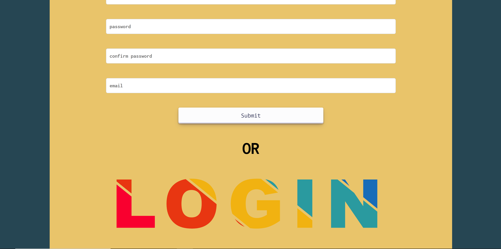
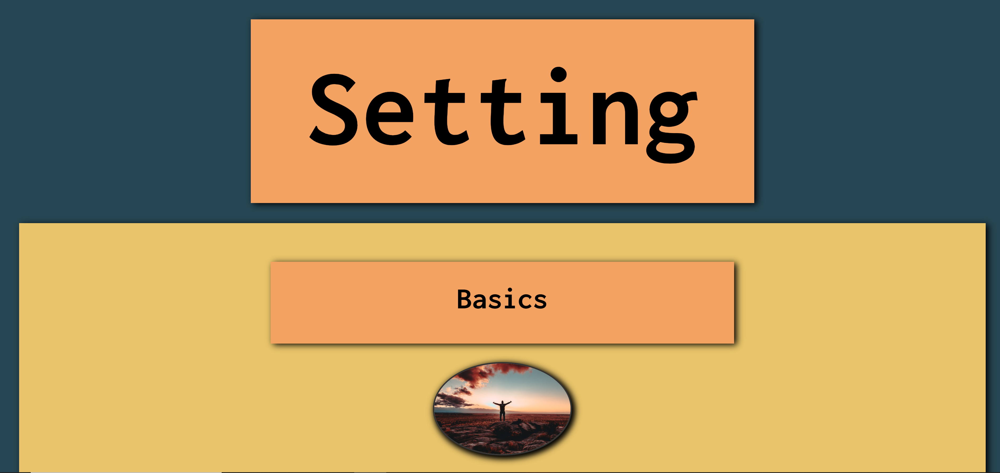

# OXDgram

# Social Media Website
Welcome to our Social Media Website, a dynamic social networking platform developed using Django and React. This application allows users to interact with each other in a variety of ways, similar to popular social media platforms.

## Project Introduction
The Social Media Website is designed with a focus on user interaction. It offers features such as creating an account, posting messages, following other users, and viewing posts from followed users. The application is built using Django, a high-level Python web framework that enables rapid development of secure and maintainable websites, and React, a powerful JavaScript library for building user interfaces.

The backend of the application is handled by Django, which takes care of user authentication, data management, and server-side logic. Django's "batteries included" philosophy provides almost everything developers might want to do "out of the box", making it a robust choice for the backend of our application.

The frontend of the application is built using React. With its component-based architecture, React allows us to create a highly interactive and responsive user interface. By handling the view layer of our application, React ensures a seamless user experience techiediaries.com.

## Key Features
- User Registration and Authentication: Users can create a new account and log in to the application. Django's built-in authentication system is used to handle user registration and authentication.
- Posting Messages: Users can post messages which will be visible to all their followers.
- Following Users: Users can follow other users. Once a user follows another user, they will be able to see their posts.
- Viewing Posts: The posts are displayed in a feed format.
- Viewing Users: Users can see user profiles.
This project is a great opportunity to learn and understand how a full-fledged social media website works, and how React and Django can be used together to build powerful web applications

## Getting Started
These instructions will get you a copy of the project up and running on your local machine for development and testing purposes.

## Prerequisites
List what software and versions are needed to run your project and how to install them.

- Python 3.8
- Django 3.2.5
- Node.js 14.17.0
- React 17.0.2
## Installation
Provide a step-by-step guide on how to get a development environment running. This will likely include cloning the repository, installing dependencies, and setting up a database.

1. Clone this repository to your local machine using `git clone https://github.com/seyed0123/OXDgram.git`.
2. Navigate to the project directory with `cd OXDgram`.
3. Install the JavaScript dependencies with `npm install`.
4. Migrate the database using `python manage.py migrate`.
## Running the Application
Explain how to start your application. For a Django and React application, this might involve running the Django server and the React development server.

1. Start the Django server with `python manage.py runserver`.
2. In a new terminal window, navigate to the frontend directory with `cd frontend`.
3. Start the React development server with `npm start`.
## Running Tests
Run the tests using `python manage.py test`.
Built With
List the major frameworks and libraries that you used to build your application.

- [Django](https://www.djangoproject.com/) - The web framework used for the backend
- [React](https://reactjs.org/) - The library used for the frontend
## diagrams
### database

### views

## License

This project is licensed under the MIT License - see the [LICENSE.md](LICENSE.md) file

## screen shots
### server

### login

### create account

### setting

### profile

### home

